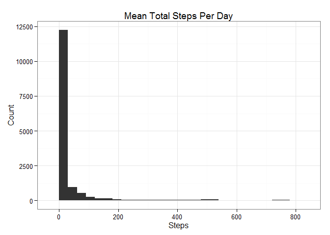
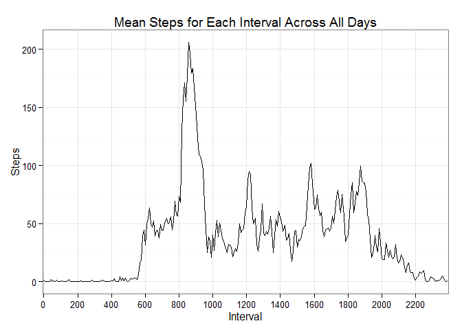
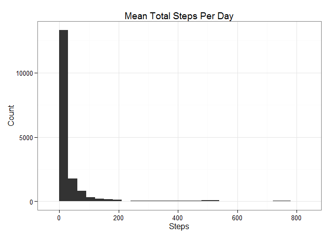
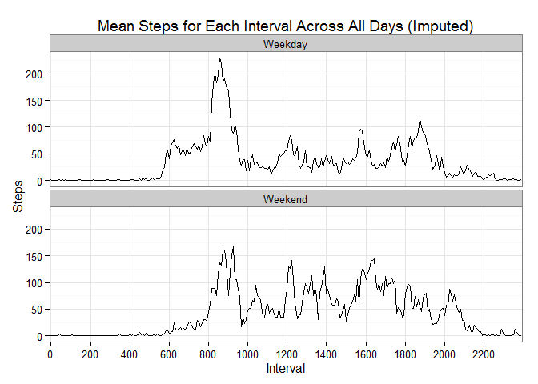

# Peer Assessment 1 for Coursera Data Science Course 5 (Reproducible Research)
Sanjeev V Namjoshi  
September 20th, 2015  

Peer assessment 1 requires that we take activity monitoring data from personal movement
monitoring devices and perform a number of required analyses on these data. The aim of
this course is to generate reproducible data so that others looking at this data can
understand and reproduce any data transformations and analyses that were conducted and
perform the exact same operations themselves.

The data needed for this assignment can be found in Github repository (activity.zip). 
There are 3 variables in this data set:

- steps: The number of steps taken in a 5-minute interval
- date: The date on which the measurement was taken (YYYY-MM-DD) format
- interval: The identifier for the 5-minute interval

### Loading and preprocessing the data
#### 1. Load packages and load the data (i.e. `read.csv()`) from working directory


```r
library(ggplot2)
library(dplyr)

data <- read.csv("activity.csv", header = TRUE)
```

#### 2. Process/transform the data (if necessary) into a format suitable for your analysis

First, Change "date" column from class factor to class date


```r
data$date <- as.Date(data$date)
```
### What is mean total number of steps taken per day?
#### 1. Calculate the total number of steps taken per day.

Simply use the sum function on the steps variable to calculate the total number of steps per day. We need to remove NA values for this function to work.


```r
sum(data$steps, na.rm = TRUE)
```

```
## [1] 570608
```

#### 2. Make a histogram of the total number of steps taken each day.


```r
ggplot(data, aes(x = steps)) +
	geom_bar(binwidth = 30) +
	ggtitle("Mean Total Steps Per Day") +
	xlab("Steps") +
	ylab("Count") +
	theme_bw()
```

 

#### 3. Calculate and report the mean and median of the total number of steps taken per day.

Calculating the mean and median is similar to calculating the sum. We are simply computing the values over ALL steps.


```r
mean(data$steps, na.rm = TRUE)
```

```
## [1] 37.3826
```

```r
median(data$step, na.rm = TRUE)
```

```
## [1] 0
```

### What is the average daily activity pattern?
#### 1. Make a time series plot (i.e. `type = "l"`) of the 5-minute interval (x-axis) and the average number of steps taken, averaged across all days (y-axis).

To plot the 5 minute interval v. the average number of steps taken across all days, we first need to split the data set by 5 minute interval. Then we can compute the mean steps per interval. Finally we can then graph these two variables against each other.

Note that the factors must be ordered properly for ggplot to graph it.


```r
# First, split the data by 5-minute interval
splitInterval <- split(data, data$interval)

# Now apply mean to the interval column across each day and set column names
meanInterval <- stack(lapply(splitInterval, function(x) mean(x$steps, na.rm = TRUE)))
names(meanInterval) <- c("MeanSteps", "Interval")
meanInterval$Interval <- factor(meanInterval$Interval, levels = meanInterval$Interval)

# Graph the data
ggplot(meanInterval, aes(x = Interval, y = MeanSteps, group = 1)) +
	geom_line() +
	scale_x_discrete(breaks = seq(0,2355, by = 200))+
	ggtitle("Mean Steps for Each Interval Across All Days") +
  xlab("Interval") +
  ylab("Steps") +
	theme_bw()
```

 

#### 2. Which 5-minute interval, on average across all the days in the dataset, contains the maximum number of steps?

To determine this, we need to subset on the data frame to find the row with the max number of mean steps. Returning the "Interval" column then gives the corresponding interval that had the max number of mean steps.


```r
meanInterval[meanInterval$MeanSteps == max(meanInterval$MeanSteps), "Interval"]
```

```
## [1] 835
## 288 Levels: 0 5 10 15 20 25 30 35 40 45 50 55 100 105 110 115 120 ... 2355
```

### Imputing missing values
#### 1. Calculate and report the total number of missing values in the dataset (i.e. the total number of rows with `NA`s)

The `complete.cases` function returns `TRUE` if there are no NAs in a particular row. The negation of this will thus tell us if that row has an NA or not. By taking the sum of this logical vector we can determine the total number of NAs in the data set.


```r
sum(!complete.cases(data$steps))
```

```
## [1] 2304
```

#### 2. Devise a strategy for filling in all of the missing values in the dataset.

To impute NA values we can use the mean steps for that 5 minute interval across the whole data set. If, on average, the individual walks a certain mean amount of steps in that five minute interval it would not be unreasonable to believe that they would respond similarly across other five minute intervals (on average). 

The impute function will accomplish this task.


```r
impute <- function(interval) {
	# Determine which rows have an NA
	naRows <- which(is.na(interval$steps))  
	
	# Get the mean steps for ALL intervals in the dataframe
	meanInterval <- stack(lapply(splitInterval, function(x) mean(x$steps, na.rm = TRUE)))
	names(meanInterval) <- c("MeanSteps", "Interval")
	
	# Calculate the mean of the interval passed to the impute function
	# This step is just to make calculations easier, it's just going to return the interval number for whatever matches the interval we are correctly performing the calculation on.
	meanSteps <- meanInterval[meanInterval$Interval == mean(interval$interval), "MeanSteps"]
	
	# Set NA rows equal to the mean steps for that interval
	interval[naRows, "steps"] <- meanSteps
	
	return(interval)
}
```

#### 3. Create a new dataset that is equal to the original dataset but with the missing data filled in.

Now, we can apply the impute function to our data set.

```r
dataImpute <- lapply(splitInterval, impute)
```

Get the data back into the original format. First we will bind all the rows of the imputed list together. Then, using the `dplyr` function `arrange()` we can sort the data set by date to put it into the format it came in originally.


```r
dataImpute <- do.call(rbind, dataImpute)
dataImpute <- arrange(dataImpute, date)
```

#### 4. Make a histogram of the total number of steps taken each day and Calculate and report the mean and median total number of steps taken per day.


```r
ggplot(dataImpute, aes(x = steps)) +
	geom_bar(binwidth = 30) +
	ggtitle("Mean Total Steps Per Day") +
	xlab("Steps") +
	ylab("Count") +
	theme_bw()
```

 

#### Calculate and report the mean and median total number of steps taken per day.


```r
mean(dataImpute$steps)
```

```
## [1] 37.3826
```

```r
median(dataImpute$steps)
```

```
## [1] 0
```

#### Do these values differ from the estimates from the first part of the assignment?

No. They are identical. This is not too surprising considering the small percentage of NAs across the whole dataset. The mean is not going to be affected too much considering we took the mean for each interval when we imputed values. Likewise, there are so many 0 values in the data set that the median will be unaffected as well.

#### What is the impact of imputing missing data on the estimates of the total daily number of steps?


```r
sum(dataImpute$steps)
```

```
## [1] 656737.5
```

As we can see, this is much higher than the daily steps for the data set before imputing. This is clearly expected because we have added in more steps for days which previously had no data.

### Are there differences in activity patterns between weekdays and weekends?
#### 1. Create a new factor variable in the dataset with two levels - "weekday" and "weekend" indicating whether a given date is a weekday or weekend day.

The `weekend()` function tells us the day of the week for each date. The `%in%` operator returns a logical vector if the day is equal to "Saturday" or "Sunday". 


```r
dataImpute <- cbind(dataImpute, Weekend = factor(weekdays(dataImpute$date) %in% c("Saturday", "Sunday")))
```

Next, we split the data frame by TRUE (weekend) or FALSE (weekday).


```r
weekend <- split(dataImpute, dataImpute$Weekend)$'TRUE'
weekday <- split(dataImpute, dataImpute$Weekend)$'FALSE'
```

The next question is going to ask us to graph the data. To get the data into the correct format for this and fulfill the requirements of question 1 in this section (a factor variable with the levels "weekday" and "weekend"), we can create a function to do some of the work.

This function calculate the mean 5-minute interval, sets the column names, then orders the factor levels.


```r
meanStepAcrossIntervals <- function(day) {
	splitInterval <- split(day, day$interval)
	meanInterval <- stack(lapply(splitInterval, function(x) mean(x$steps, na.rm = TRUE)))
	names(meanInterval) <- c("MeanSteps", "Interval")
	meanInterval$Interval <- factor(meanInterval$Interval, levels = meanInterval$Interval)
	
	return(meanInterval)
}
```

Now, apply the function to our weekend and weekday split data sets:


```r
weekendMean <- meanStepAcrossIntervals(weekend)
weekdayMean <- meanStepAcrossIntervals(weekday)
```

And, finally, let's put everything together into one dataset and label the last column as "Day" to indicate if it's a weekday or weekend. This fulfills what was asked in question 1 of this section.


```r
allDays <- rbind(weekdayMean, weekendMean)
allDays <- cbind(allDays, Day = c(rep("Weekday",288), rep("Weekend",288)))
```

#### 2. Make a panel plot containing a time series plot (i.e. type = "l") of the 5-minute interval (x-axis) and the average number of steps taken, averaged across all weekday days or weekend days (y-axis).

To make the planel plot we can just graph the data (similar to the earlier question) and then at a facet element to the plot split by the "Day" variable indicating the weekday or weekend.


```r
g <- ggplot(allDays, aes(x = Interval, y = MeanSteps, group = 1)) +
	geom_line() +
	scale_x_discrete(breaks = seq(0,2355, by = 200))+
	ggtitle("Mean Steps for Each Interval Across All Days (Imputed)") +
	xlab("Interval") +
	ylab("Steps") +
	theme_bw()

g + facet_wrap(~ Day, ncol = 1)
```

 

As we can see from the graph, there are indeed differences in activity patterns between the weekday and weekend.

? knit2html()
